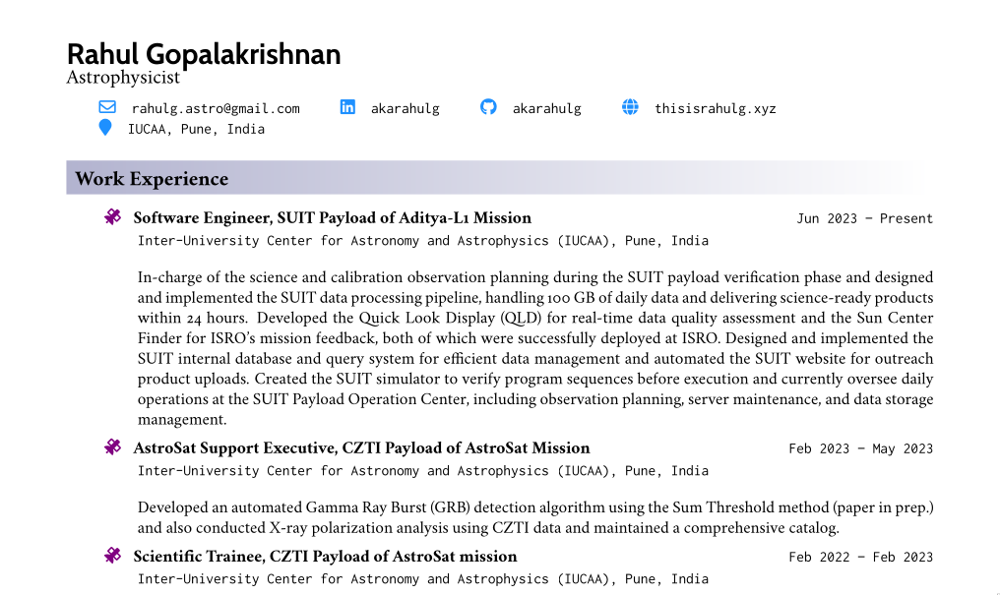
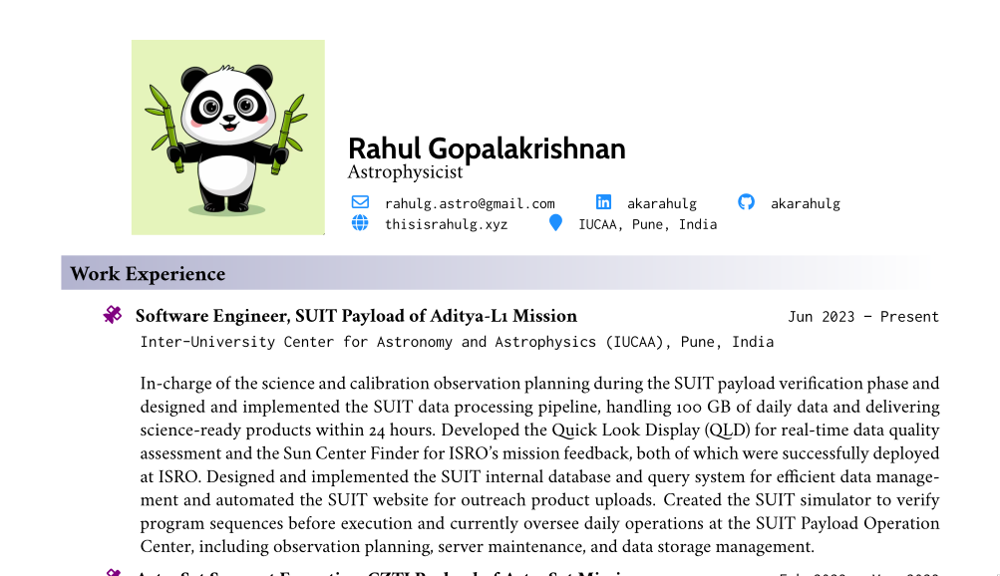

# legendCV – The Only Academic CV You’ll Ever Need

`legendCV` is a LaTeX template for creating an academic CV. This template is designed to be easy to use and customize, allowing you to create a polished and professional CV quickly.

## Screenshots
### Without Photo


### With Photo


[Click here to view the full compiled PDF](https://github.com/akarahulg/legendCV/blob/main/cvmain.pdf)
## Features

- Customizable fonts and colors
- Sections for experience, research, publications, education, skills, workshops, miscellaneous, and references
- Easy to add contact details and profile picture
- Uses `biblatex` for managing publications

## Getting Started

### Prerequisites

To use this template, you need to have LaTeX installed on your system. You can download and install LaTeX from [here](https://www.latex-project.org/get/).

### Installation

1. Clone the repository:

    ```sh
    git clone https://github.com/akarahulg/legendCV.git
    cd legendCV
    ```

2. Open the `cvmain.tex` file in your favorite LaTeX editor.

### Usage

1. Customize your CV by editing the `cvmain.tex` file. You can change the fonts, colors, and contact details as needed.

2. Add your content to the respective section files:
    - `experience.tex`
    - `research.tex`
    - `publications.tex`
    - `education.tex`
    - `skills.tex`
    - `workshops.tex`
    - `miscellaneous.tex`
    - `references.tex`

3. `publications.bib` is where you add all the `BibTex` of your publications. You can add conference proceedings and papers that are in preparation. Give the subheadings as needed from the following tex snippet:
   
    ```tex
    \printbibliography[heading={subbibliography},title={Journal Articles},type=article]
    \printbibliography[heading={subbibliography},title={In Preparation},type=unpublished]
    \printbibliography[heading={subbibliography},title={Conference Proceedings},type=inproceedings]
    ```

4. Compile the `cvmain.tex` file using your LaTeX editor or from the command line:

    ```sh
    pdflatex cvmain.tex
    biber cvmain
    pdflatex cvmain.tex
    pdflatex cvmain.tex
    ```

5. Your CV will be generated as `cvmain.pdf`.

### Customization

- **Fonts**: You can change the fonts used in the CV by modifying the font packages in the `cvmain.tex` file.
- **Colors**: You can set the icon color using the `\seticoncolor` command in the `cvmain.tex` file.
- **Profile Picture**: Uncomment the line with `\cvheader` that includes `photo.png` and add your profile picture to the project directory.

### CV Commands

Here is an explanation of the custom CV commands available in the `legendcv.sty` file:

- **\cvheader**: Sets the name, job title, and optional photo.
    ```tex
    \cvheader[Job Title]{Name}{photo.png}
    ```

- **\cvcontact**: Adds a contact detail with an icon.
    ```tex
    \cvcontact{\faEnvelope[regular]}{mailto:your.email@example.com}{your.email@example.com}
    ```

- **\printheader**: Prints the header with the name, job title, and contact details.
    ```tex
    \printheader
    ```

- **\cventry**: Adds an entry to the CV with an icon, title, and date range.
    ```tex
    \cventry[Optional Description]{icon}{Title}{Start Date}{End Date}
    ```

- **\cvbigentry**: Adds a detailed entry with an icon, degree, institution, and date range.
    ```tex
    \cvbigentry[Optional Topic]{icon}{Degree}{Institution}{Start Date}{End Date}
    ```

- **\cvskill**: Adds a skill entry with an icon, skill name, and description.
    ```tex
    \cvskill{Skill Name}{icon}{Description}
    ```

- **\cvdescitem**: Adds a description item with a bullet icon.
    ```tex
    \cvdescitem{Description}
    ```

- **\cvdescpara**: Adds a description paragraph.
    ```tex
    \cvdescpara{Description}
    ```

- **\cvspacer**: Adds space between entries.
    ```tex
    \cvspacer
    ```

- **\cvsection**: Adds a section header with a gradient background.
    ```tex
    \cvsection{Section Title}
    ```

- **\cvsubsection**: Adds a subsection header.
    ```tex
    \cvsubsection{Subsection Title}
    ```

- **\cvonelineentry**: Adds a one-line entry with an icon and description.
    ```tex
    \cvonelineentry[Date]{icon}{Description}
    ```

### Example

Here is an example of how to define your contact details in the `cvmain.tex` file:

```tex
\cvcontact{\faEnvelope[regular]}{mailto:your.email@example.com}{your.email@example.com}
\cvcontact{\faLinkedin}{https://linkedin.com/in/yourprofile}{yourprofile}
\cvcontact{\faGithub}{https://github.com/yourusername}{yourusername}
\cvcontact{\faGlobe}{http://yourwebsite.com/}{yourwebsite.com}
\cvcontact{\faMapMarker}{Your Address}{Your Address}
